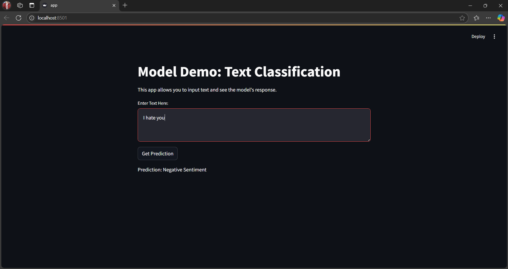
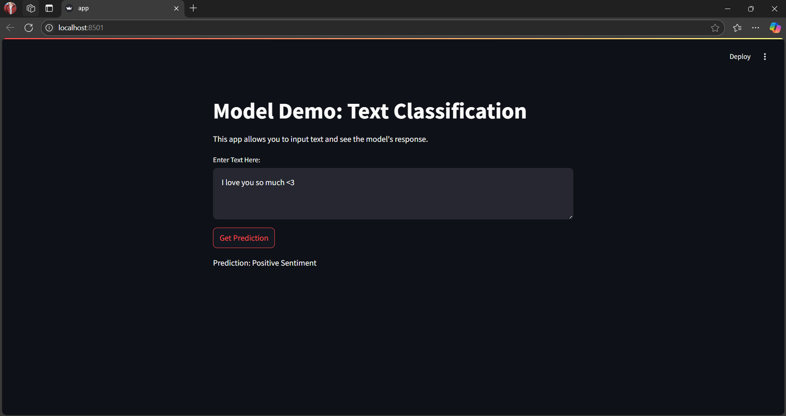

# Documentation

## Task 1: Finding a Suitable Dataset

### Dataset Source
- **Dataset**: [openai/summarize_from_feedback](https://huggingface.co/datasets/openai/summarize_from_feedback)
- **Split Used**: Validation split (5% for quicker runs)

### Preprocessing Steps

#### Load the Dataset:
The dataset `openai/summarize_from_feedback` was loaded using the Hugging Face Datasets library. The validation split was selected, and 5% of the data was used for quicker runs.

#### Simulate Labels:
Binary labels were simulated for the preference task. These labels were randomly generated to represent the feedback or ranking for training the model.

#### Tokenize the Dataset:
The dataset was tokenized using the `distilbert-base-uncased` tokenizer. The tokenization was performed with padding to the maximum length and truncation as needed.

## Task 2: Training a Model with DPOTrainer

### Model and Training Details
- **Model Used**: `distilbert-base-uncased`

### Training Setup:
The model was fine-tuned using the Hugging Face `Trainer` class with the provided dataset. Training arguments were configured to include settings like learning rate, batch size, and the number of epochs for optimizing model performance.

### Hyperparameters:
- **Learning Rate**: `3e-5`
- **Batch Size**: `16`
- **Number of Epochs**: `1`
- **Weight Decay**: `0.01`

### Training Performance
- **Training Time**: Approximately 28 minutes

### Suggestions for Longer Training Time:
- Use a larger portion of the dataset, such as 50% of the validation split, to provide more data for the model to learn from.
- Increase the number of epochs to improve model accuracy and stability.
- Decrease the batch size to allow more iterations per epoch, which can help fine-tune the model further.
- Consider using a slightly larger model (e.g., `bert-base-uncased`) for better performance if the GPU can support it.

## Task 3: Pushing the Model to Hugging Face Hub

### Model Upload Details
- **Repository Name Pattern**: `dpo_model_lr{lr}_bs{bs}_epoch{epoch}`
- **Hugging Face Model Hub Link**: [https://huggingface.co/vltruong01](https://huggingface.co/vltruong01)

### Steps to Upload the Model

#### Save the Trained Model:
The trained model was saved at the end of the training process using the `trainer.save_model` method. Each model was saved in directories based on the hyperparameter configuration (e.g., learning rate, batch size, number of epochs).

#### Upload the Model to the Hugging Face Model Hub:
The `huggingface_hub` library was used to upload the model. A repository was created for each model configuration, and the model files were pushed to the Hugging Face Hub using the repository's URL.

Model Repository URL: [https://huggingface.co/vltruong01/dpo_model_lr5e-05_bs16_epoch1](https://huggingface.co/vltruong01/dpo_model_lr5e-05_bs16_epoch1)
Commit URL: [Commit Details](https://huggingface.co/vltruong01/dpo_model_lr5e-05_bs16_epoch1/commit/41fa77d17bf8b4b71cee318efc86e41d3a4f2909)

## Task 4: Deploy

